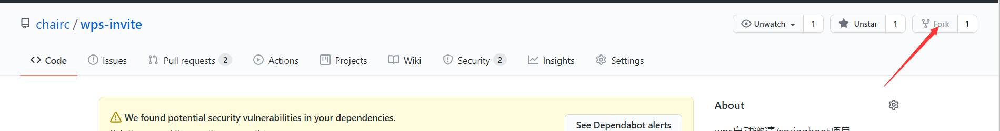
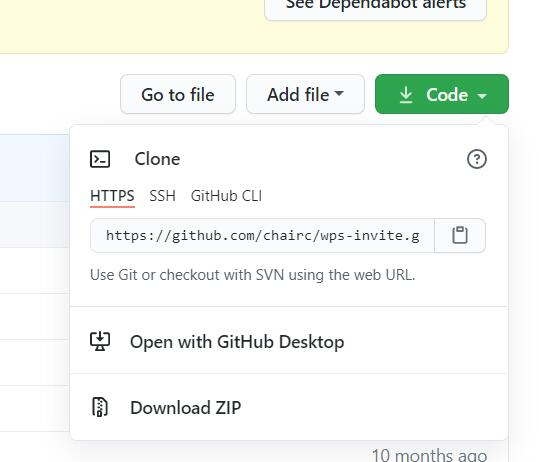
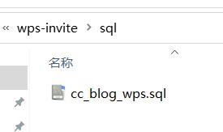
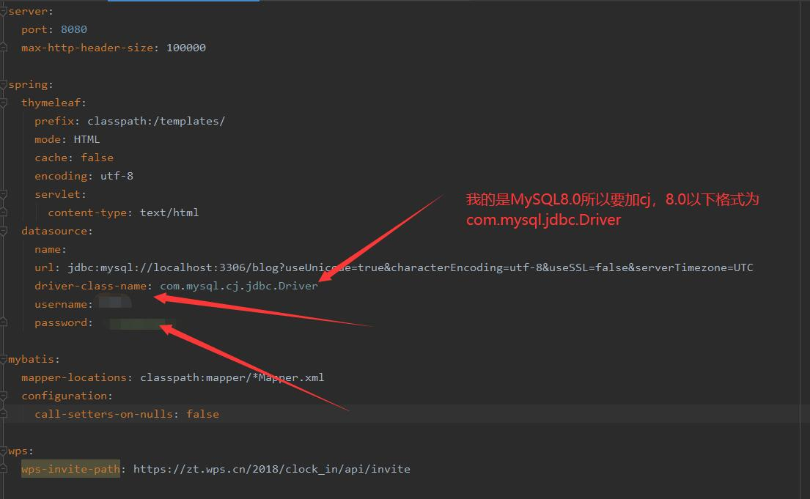
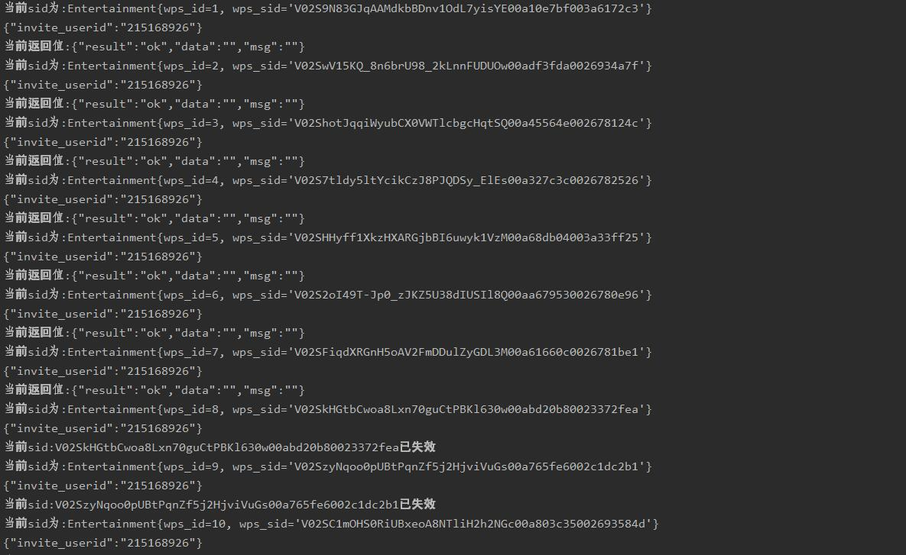

# WPS自动邀请说明

## 基本说明

本项目`不是全自动`，需要用户每日13点前在微信WPS会员公众号完成在线签到。再完成签到后即可输入自己uid完成自动拉满10人的任务。本项目仅用于学习，不用于商业。

## 具体步骤

1. 添加微信公众号`WPS会员`→`福利&签到`→`打卡免费领会员`→`签到`
2. 进入个人中心记录下自己的`uid`

3. fork本项目到自己库中，在自己服务器上部署，或是参考源码写到自己的JAVA项目中

4. 如果真有懒人的话参考本人网站自动邀请页面[WPS邀请demo](https://chairc.cn/entertainment/wps "WPS邀请demo")
5. 可在`WPS会员`→`福利&签到`→`打卡免费领会员`→`任务`下查看到邀请数

## 配置项目步骤

1. 将本项目fork到自己库中并下载到本地

2. 数据库文件在sql包中，部署到本地数据库，我的项目使用的mysql8.0

3. 使用编辑器打开项目，配置yml文件，主要是配置数据库

4. 因为是springboot易于部署，以上步骤都完成好之后启动该项目，输入测试uid

## 最后

由于近期WPS官方限制连续邀请，本项目更改为2s一次发送邀请请求

老项目的博客文章地址：[老WPS邀请demo](https://chairc.cn/article/title/article_ZxAhuEYyhNjkgyV "老WPS邀请demo博客文章地址")